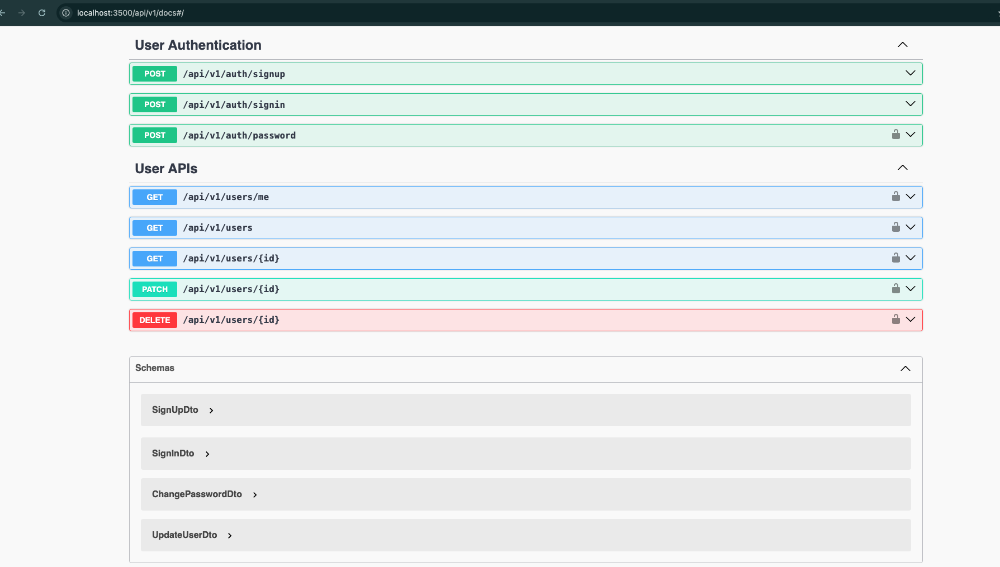
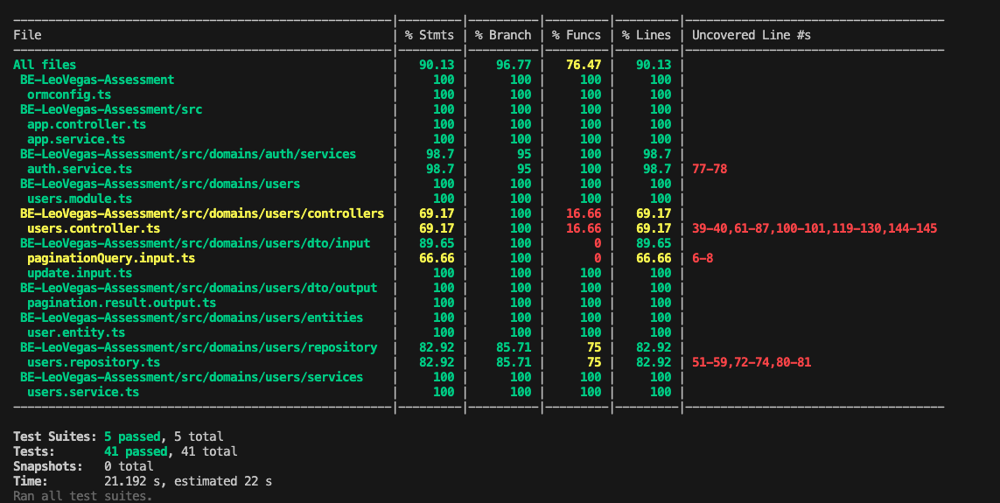

[](https://badge.fury.io/js/nestjs)
[](https://opensource.org/licenses/MIT)

---

## Table of Contents

- [Description](#description)
- [Features](#features)
  - [User Model](#user-model)
  - [Project Structure](#project-structure)
- [Role-based Access Control](#role-based-access-control)
- [Key Access Rules](#key-access-rules)
- [API Specification](#api-specification)
  - [Authentication Endpoints](#authentication-endpoints)
  - [User Endpoints](#user-endpoints)
- [Database](#database)
- [Frameworks and Libraries](#frameworks-and-libraries)
- [Installation and Running the Application](#installation-and-running-the-application)
- [How to Test](#how-to-test)
- [Access and Testing of API Endpoints Documentation](#access-and-testing-of-api-endpoints-documentation)
- [Test Coverage Report](#test-coverage-report)
- [Author](#author-💥)

---

## Description

This project is a RESTful API for managing users with robust role-based access control (RBAC). It supports creating, reading, updating, and deleting users, while ensuring proper authorization and adhering to HTTP/REST best practices and the JSON:API specification. 

---

## Features

### User Model
The `User` model includes the following fields:
```json
{
  "name": "John Doe",
  "email": "johndoe@example.com",
  "password": "password",
  "role": "USER" | "ADMIN",
  "access_token": "..."
}
```

## Project Structure

```bash
src/
common/               # Common utilities
  ├── custom-pipes/       # Custom pipes for validation
  ├── database/           # Database connection
  ├── decorators/         # Custom decorators
  ├── base.entity.ts      # Base entity class
  ├── constants.ts        # Constants for tables and roles
domains/
  ├── auth/                 # Authentication module
  ├── users/                # User module
swagger/                 
  ├── constant.ts           # Constants used in the swagger documentation
  ├── index.ts              # Swagger documentation configuration
├── app.module.ts           # Main application module
├── app.service.ts          # Main application service
├── main.ts                 # Entry point for the application
test/
  ├── integration/           # Integration test cases
  ├── unit/                  # Unit test cases
.env.example               # Environment variable template
ormconfig.ts               # Database TypeORM configuration

```

## Role-based Access Control

### USER:
- Can view their own details.
- Can update their own details, excluding password, email and role changes.
- Can update their own password via a change of password endpoint. 
- Can not delete themselves.

### ADMIN:
- Can view details of any user.
- Can update details and roles of any user.
- Can delete other users (cannot delete themselves).

---

## Key Access Rules
- No role can delete themselves.
- Users attempting unauthorized actions receive appropriate HTTP status codes.
- Admin actions on non-existent users return proper HTTP status codes.

---

## API Specification
- **JSON:API** specification is followed.
- Proper validation of input data is implemented using **class-validator** and **zod**
- Comprehensive error handling is included.

---

## Endpoints
**Base URL**: `http://localhost:3500/api/v1`

### Authentication Endpoints
1. **POST** `/auth/signup`
   - **Purpose**: Register a new user.
   - **Request Body**:
     ```json
     {
       "name": "John Doe",
       "email": "johndoe@example.com",
       "password": "password",
       "role": "USER" | "ADMIN"
     }
     ```
   - **Response**: Returns the created user's details.

2. **POST** `/auth/signin`
   - **Purpose**: Authenticate a user and issue an access token.
   - **Request Body**:
     ```json
     {
       "email": "johndoe@example.com",
       "password": "password"
     }
     ```
   - **Response**: Returns a user data and access token.

3. **POST** `/auth/password`
   - **Purpose**: Change the password for the authenticated user.
   - **Request Body**:
     ```json
     {
       "oldPassword": "current_password",
       "newPassword": "new_secure_password"
     }
     ```
   - **Response**: Success message indicating the password has been updated.

---

### User Endpoints
4. **GET** `/users/me`
   - **Purpose**: Retrieve details of the currently authenticated user.
   - **Response**: Returns the user’s details.

5. **GET** `/users`
   - **Purpose**: Retrieve a list of all users (ADMIN only).
   - **pagination** for listing endpoints.
      - **Query Parameters** (optional):
        - `?page` - Specify the page number for pagination.
        - `?limit` - Specify the number of results per page.
   - **Response**: Returns a paginated list of users.
   

6. **GET** `/users/:id`
   - **Purpose**: Retrieve details of a specific user.
   - **Path Parameter**:
     - `:id` - ID of the user to fetch.
   - **Response**: Returns the user’s details.

7. **PATCH** `/users/:id`
   - **Purpose**: Update details of a specific user.
   - **Path Parameter**:
     - `:id` - ID of the user to update.
   - **Request Body**:
     ```json
     {
       "name": "Updated Name",
       "role": "USER" // ADMIN only
     }
     ```
   - **Response**: Returns the updated user details.

8. **DELETE** `/users/:id`
   - **Purpose**: Delete a specific user (ADMIN only).
   - **Path Parameter**:
     - `:id` - ID of the user to delete.
   - **Response**: Success message indicating the user has been deleted.
   - **Special Rule**: Users cannot delete themselves; appropriate error response is returned.

---

- Each of the endpoints will return one or more of the following status codes:
  - **200 OK**: For successful GET, PATCH, or DELETE operations.
  - **201 Created**: For successful POST operations.
  - **400 Bad Request**: For invalid inputs or requests.
  - **401 Unauthorized**: For missing or invalid authentication tokens.
  - **403 Forbidden**: For unauthorized actions.
  - **404 Not Found**: When the resource (user) does not exist.

## Database
- The API uses **MySQL** to store user data, connected via **TypeORM**.

---

## Frameworks and Libraries
- **NestJS**: Backend framework for scalability and maintainability.
- **TypeScript**: Strict type checking for better code quality.
- **TypeORM**: Object-relational mapping for database operations.
- **MySQL**: Relational database for structured data storage.
- **Swagger**: API documentation.
- **Jest**: Unit and integration testing framework.
- **Testcontainers**: Docker-based integration testing.

---

## Installation and Running the Application

- After cloning the repository, create a `.env` file from `.env.sample` and set your local `.env.` variable(s).

```sh
cp .env.sample .env
```

## How to Test

1. `npm install` - Installs dependencies.
2. `npm run start:dev` - Starts the server in development mode.
3. `npm run test` - Runs the test suite(both unit and integration tests).
4. `npm run test:unit` - Runs only unit tests.
5. `npm run test:int` - Runs only integration tests.

## Access and Testing of API Endpoints Documentation.

- Swagger documentation can be accessed on this localhost link [Swagger Docs Link](http://localhost:3500/api/v1/docs) when the server is running.



---
## Test Coverage Report

- The test coverage report for bot unit and integration tests is shown below after running the test suite.



---

## Author 💥:

Francis Nnamdi Abonyi
