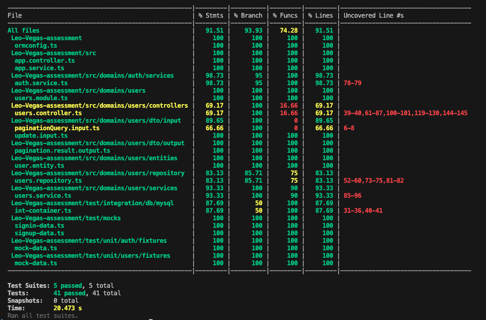

[](https://badge.fury.io/js/nestjs)
[](https://opensource.org/licenses/MIT)

---

# Leo-Vegas

## Table of Contents

- [Description](#description)
- [Features](#features)
  - [User Model](#user-model)
  - [Project Structure](#project-structure)
- [Role-based Access Control](#role-based-access-control)
- [Key Access Rules](#key-access-rules)
- [API Specification](#api-specification)
  - [Authentication Endpoints](#authentication-endpoints)
  - [User Endpoints](#user-endpoints)
- [Database](#database)
- [Frameworks and Libraries](#frameworks-and-libraries)
- [Installation and Running the Application](#installation-and-running-the-application)
- [How to Test](#how-to-test)
- [Access and Testing of API Endpoints Documentation](#access-and-testing-of-api-endpoints-documentation)
- [Test Coverage Report](#test-coverage-report)
- [Author](#author-)

---

## Description

This project is a RESTful API for managing users with robust role-based access control (RBAC). It supports creating, reading, updating, and deleting users while ensuring proper authorization and adhering to HTTP/REST best practices and the JSON:API specification.

---

## Features

### User Model
The `User` model includes the following fields:

```json
{
  "name": "John Doe",
  "email": "johndoe@example.com",
  "password": "password",
  "role": "USER" | "ADMIN",
  "access_token": "..."
}
```

## Project Structure

```bash
src/
common/               # Common utilities
  ├── custom-pipes/       # Custom pipes for validation
  ├── database/           # Database connection
  ├── decorators/         # Custom decorators
  ├── base.entity.ts      # Base entity class
  ├── constants.ts        # Constants for tables and roles
domains/
  ├── auth/               # Authentication module
  ├── users/              # User module
swagger/                 
  ├── constant.ts         # Constants used in the swagger documentation
  ├── index.ts            # Swagger documentation configuration
├── app.module.ts         # Main application module
├── app.service.ts        # Main application service
├── main.ts               # Entry point for the application
test/
  ├── integration/        # Integration test cases
  ├── unit/               # Unit test cases
.env.example              # Environment variable template
ormconfig.ts              # Database TypeORM configuration
```

---

## Role-based Access Control

### Roles and Permissions
| Role   | Action                                   | Permission                  |
|--------|------------------------------------------|-----------------------------|
| USER   | View their own details                  | ✅ Yes                      |
|        | Update their details (excluding email)  | ✅ Yes                      |
|        | Change their password                   | ✅ Yes                      |
|        | Delete themselves                       | ❌ No                       |
| ADMIN  | View any user details                   | ✅ Yes                      |
|        | Update any user details and roles       | ✅ Yes                      |
|        | Delete other users                      | ✅ Yes                      |
|        | Delete themselves                       | ❌ No                       |

---

## Key Access Rules

- **Self-deletion:** No role can delete themselves.
- **Unauthorized actions:** Users attempting unauthorized actions receive appropriate HTTP status codes.
- **Non-existent users:** Admin actions on non-existent users return proper HTTP status codes.

---

## API Specification

### General Guidelines
- **JSON:API** specification is followed.
- Proper validation of input data is implemented using **class-validator** and **zod**.
- Comprehensive error handling is included.

**Base URL**: `http://localhost:3500/api/v1`

### Authentication Endpoints

1. **POST** `/auth/signup`
   - **Purpose**: Register a new user.
   - **Request Body**:
     ```json
     {
       "name": "John Doe",
       "email": "johndoe@example.com",
       "password": "password",
       "role": "USER" | "ADMIN"
     }
     ```
   - **Response**:  
      ```json
      {
          "id": "b61c526e-55b7-434b-8d09-ae0d776533e0",
          "name": "John Doe",
          "email": "johndoe@example.com",
          "role": "USER" | "ADMIN",
          "created_at": "2021-10-10T12:00:00.000Z",
          "updated_at": "2021-10-10T12:00:00.000Z",
          "access_token": "eyJhbGciOiJIUzI1NiIsInR5cCI6IkpXVCJ9..."
      }
     ```

2. **POST** `/auth/signin`
   - **Purpose**: Authenticate a user and issue an access token.
   - **Request Body**:
     ```json
     {
       "email": "johndoe@example.com",
       "password": "password"
     }
     ```
   - **Response**: 
       ```json
        {
          "id": "732fde67-0076-4f0b-aba6-7b052975c02d",
          "name": "John Doe",
          "email": "johndoe@example.com",
          "role": "USER" | "ADMIN",
          "created_at": "2021-10-10T12:00:00.000Z",
          "updated_at": "2021-10-10T12:00:00.000Z",
          "access_token": "eyJhbGciOiJIUzI1NiIsInR5cCI6IkpXVCJ9..."
        }
     ```

3. **POST** `/auth/password`
   - **Purpose**: Change the password for the authenticated user.
   - **Request Body**:
     ```json
     {
       "oldPassword": "current_password",
       "newPassword": "new_secure_password"
     }
     ```
   - **Response**: Success message indicating the password has been updated.
     ```json
      {
        "message": "Password updated successfully!"
      }
        ```
---

### User Endpoints

4. **GET** `/users/me`
   - **Purpose**: Retrieve details of the currently authenticated user.
   - **Response**: 
      ```json
      {
          "id": "732fde67-0076-4f0b-aba6-7b052975c02d",
          "name": "John Doe",
          "email": "johndoe@example.com",
          "role": "USER" | "ADMIN",
          "created_at": "2021-10-10T12:00:00.000Z",
          "updated_at": "2021-10-10T12:00:00.000Z"
      }
     ```

5. **GET** `/users`
   - **Purpose**: Retrieve a list of all users (ADMIN only).
   - **Query Parameters** (optional):
     - `?page` - Specify the page number for pagination.
     - `?limit` - Specify the number of results per page.
   - **Response**: 
        ```json
        {
            "data": [
                {
                    "id": "732fde67-0076-4f0b-aba6-7b052975c02d",
                    "name": "John Doe",
                    "email": "johndoe@example.com",
                    "role": "USER",
                    "created_at": "2021-10-10T12:00:00.000Z",
                    "updated_at": "2021-10-10T12:00:00.000Z"
                },
                {
                    "id": "432fde67-0076-4f0b-aba6-7b052975c02e",
                    "name": "Admin User",
                    "email": "adin@example.com",
                    "role": "ADMIN",
                    "created_at": "2021-10-10T12:00:00.000Z",
                    "updated_at": "2021-10-10T12:00:00.000Z"
                }
            ],
            "meta": {
                "total": 2,
                "page": 2,
                "limit": 2
            },
            "links": {
                "prev": "/users?page=1&limit=2",
                "next": "/users?page=2&limit=2"
            }
        }


6. **GET** `/users/:id`
   - **Purpose**: Retrieve details of a specific user.
   - **Path Parameter**:
     - `:id` - ID of the user to fetch.
   - **Response**: 
        ```json
        {
            "id": "732fde67-0076-4f0b-aba6-7b052975c02d",
            "name": "John Doe",
            "email": "johndoe@example.com",
            "role": "USER" | "ADMIN",
            "created_at": "2021-10-10T12:00:00.000Z",
            "updated_at": "2021-10-10T12:00:00.000Z"
        }

7. **PATCH** `/users/:id`
   - **Purpose**: Update details of a specific user.
   - **Path Parameter**:
     - `:id` - ID of the user to update.
   - **Request Body**:
     ```json
     {
       "name": "Updated Name",
       "role": "USER" // ADMIN only
     }
     ```
   - **Response**: Returns Success message indicating the user detail has been updated.
     ```json
      {
        "message": "User updated successfully!"
      }
        ```

8. **DELETE** `/users/:id`
   - **Purpose**: Delete a specific user (ADMIN only).
   - **Path Parameter**:
     - `:id` - ID of the user to delete.
   - **Response**: Success message indicating the user has been deleted.
   - **Special Rule**: Users cannot delete themselves; appropriate error response is returned.

### Status Codes
- **200 OK**: For successful GET, PATCH, or DELETE operations.
- **201 Created**: For successful POST operations.
- **400 Bad Request**: For invalid inputs or requests.
- **401 Unauthorized**: For missing or invalid authentication tokens.
- **403 Forbidden**: For unauthorized actions.
- **404 Not Found**: When the resource (user) does not exist.

---

## Database
- **MySQL** is used to store user data, connected via **TypeORM**.

---

## Frameworks and Libraries
- **NestJS**: Backend framework for scalability and maintainability.
- **TypeScript**: Strict type checking for better code quality.
- **TypeORM**: Object-relational mapping for database operations.
- **MySQL**: Relational database for structured data storage.
- **Swagger**: API documentation.
- **Jest**: Unit and integration testing framework.
- **Testcontainers**: Docker-based integration testing.

---

## Installation and Running the Application

- Clone the repository and navigate to the project directory:

  ```typescript
  git clone https://github.com/AbonyiXavier/Leo-Vegas-assessment
  cd Leo-Vegas-assessment
  ```

- Create a `.env` file from `.env.sample` and configure environment variables:

  ```sh
  cp .env.sample .env
  ```

- Install dependencies:

  ```sh
  npm install
  ```

- Start the application:

  ```sh
  npm run start:dev
  ```
---

## How to Test

1. Run the full test suite:
   ```sh
   npm run test
   ```
2. Run only unit tests:
   ```sh
   npm run test:unit
   ```
3. Run only integration tests:
   ```sh
   npm run test:int
   ```

---

## Access and Testing of API Endpoints Documentation

- Swagger documentation is available at [Swagger Docs](http://localhost:3500/api/v1/docs) when the server is running.

  

---

## Test Coverage Report

- The test coverage report for both unit and integration tests is shown below after running the test suite:

  

---

## Author 💥

Francis Nnamdi Abonyi


